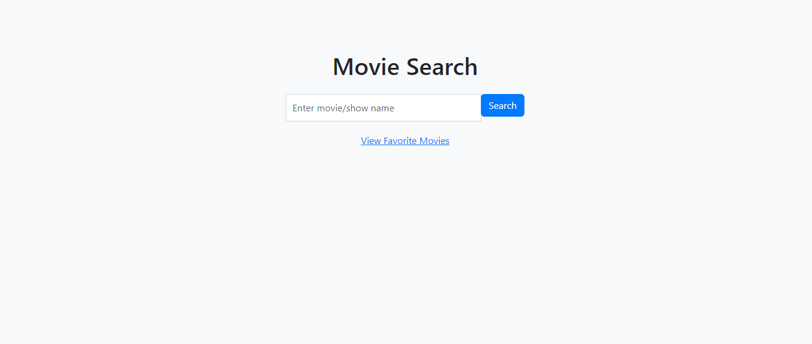
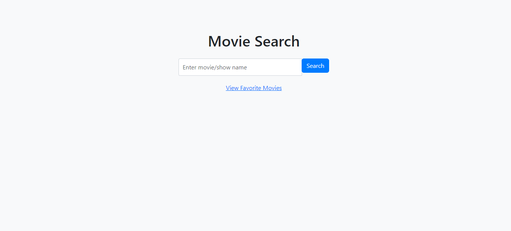
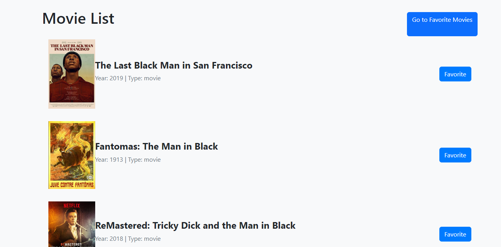
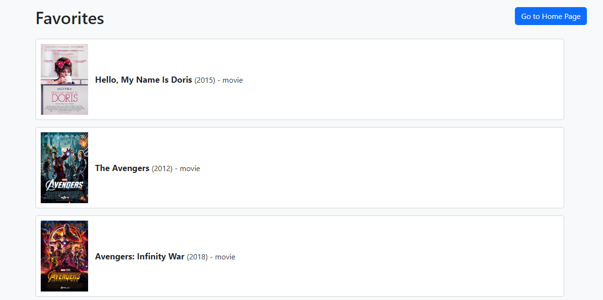

# Movie Search and Favorites App

A Node.js web application that allows users to search for movies and TV shows, mark their favorite movies, and view a list of their favorite movies.

 
## Features

- Search for movies and TV shows using an external API.
- View search results with movie titles, years, types, and posters.
- Mark movies as favorites and save them in a database.
- View a list of favorite movies.
- Responsive design for a seamless experience on various devices.

## Table of Contents

- [Getting Started](#getting-started)
  - [Prerequisites](#prerequisites)
  - [Installation](#installation)
  - [Configuration](#configuration)
- [Usage](#usage)
- [Screenshots](#screenshots)

## Getting Started

### Prerequisites

- Node.js and npm: Make sure you have Node.js and npm (Node Package Manager) installed on your machine. You can download them from the official Node.js website: https://nodejs.org/

### Installation

1. Clone the repository:

   ```sh
   git clone https://github.com/vikaschhonkar1/movie-search-app.git
   ```

2. Navigate to the project directory:

   ```sh
   cd movie-search-app
   ```

3. Install the dependencies:

   ```sh
   npm install
   ```

### Configuration

1. **Make .env File**: Make a new file named as `.env`.

2. **Add Your API Key**: Open the `.env` file in a text editor and locate the line `API_KEY=`. Replace the empty value with your actual API key. For example:

   ```env
   API_KEY=your_api_key_here
   ```

   Replace `your_api_key_here` with your real API key.

3. **Database Connection**: Provide the necessary details for your database connection:

   - `DB_HOST`: The hostname or IP address of your database server.
   - `DB_USER`: The username used to connect to the database.
   - `DB_PASS`: The password for the database user.
   - `DB_NAME`: The name of the database you'll be using.

   For example:

   ```env
   DB_HOST=localhost
   DB_USER=username
   DB_PASS=password
   DB_NAME=database_name
   ```

   Replace `localhost`, `username`, `password`, and `database_name` with your actual database connection details.

4. **Save Changes**: Save the changes you made to the `.env` file.


## Usage

1. Run the application:

   ```sh
   npm start
   ```

2. Open your web browser and navigate to `http://localhost:3000` to access the application.

3. Search for movies, view search results, and mark your favorite movies.

4. Navigate to the "View Favorite Movies" page to see your list of favorite movies.

# Screenshots
 
 
 